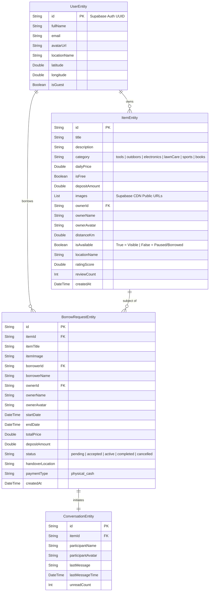

# Architecture Documentation: Borrowly

## 1. System Overview

**Borrowly** is a hyper-local peer-to-peer item sharing and borrowing community platform built with Flutter and Supabase. The application enables neighbors to list, discover, borrow, and lend household items, camping gear, tools, and electronics within a **1 km**, **2 km**, **3 km**, or **5 km (Max)** neighborhood radius.

The platform is designed around a **Live Supabase Backend** (`https://wjgvdryrtgajenlcbjfy.supabase.co`) featuring **PostGIS spatial queries**, **Supabase Storage Cloud Bucket Uploads (`item-images`)**, **Google Authentication ONLY**, **Real-Time WebSockets**, **Physical In-Person Cash Settlement**, **Item Lifecycle Management (Pause & Delete)**, **Structured Event Logging (`BorrowlyLogger`)**, **Riverpod unidirectional data flow**, **GoRouter shell branch navigation**, and a **locked Light Mode Scandinavian Sage glassmorphic design system**.

---

## 2. Tech Stack & Core Libraries

| Layer / Aspect | Framework / Tool | Purpose & Usage |
| :--- | :--- | :--- |
| **Framework & Language** | Flutter 3.x & Dart 3.x | Cross-platform UI engine targeting Android, iOS, and Web |
| **State Management & DI** | Flutter Riverpod | Reactive state management, dependency injection, and data providers |
| **Navigation & Routing** | GoRouter 13.x | Declarative routing with `StatefulShellRoute.indexedStack` for stateful tab preservation |
| **Backend & Database** | Supabase Flutter (`2.3.0`) | Live PostgreSQL database (`wjgvdryrtgajenlcbjfy`) with PostGIS, Real-Time WebSockets, and Storage CDN |
| **Cloud Storage Uploads** | `SupabaseStorageService` | Automatic cloud binary image uploads (`item-images` bucket) converting local photos to public CDN URLs |
| **Item Lifecycle** | `deleteItem` & `toggleItemAvailability` | Allows item owners to pause listings (`is_available: false`) or permanently delete items |
| **Authentication** | Google Sign-In (`google_sign_in`) | Single-click Google Sign-In authenticated via Supabase OAuth / ID Token (`signInWithIdToken`) |
| **Payment Model** | Physical In-Person Cash Handover | Zero in-app gateway fees; payments and deposits settled physically during item pickup/return |
| **Event Tracing** | `BorrowlyLogger` | Structured event logging (`🚀 [EVENT]`, `ℹ️ [INFO]`, `⚠️ [WARNING]`, `❌ [ERROR]`) |
| **Database Auto-Seeder** | `_checkAndSeedSupabase` | Auto-populates realistic neighborhood items into Supabase `items` table if empty |
| **Local Cache** | Hive & Hive Flutter | Fast key-value local caching for offline user preferences and <5ms item load fallback |
| **Async Performance** | Dart Isolates (`compute()`) | Background thread execution for heavy item filtering, distance sorting, and search matching |
| **Theme Locking** | Locked Light Mode (`ThemeMode.light`) | Warm eggshell background (`#F5F2EB`), Scandinavian Sage (`#2E5A44`), and Outfit typography |

---

## 3. High-Level Architecture (MVVM & UDF)

Borrowly strictly follows **Model-View-ViewModel (MVVM)** combined with **Unidirectional Data Flow (UDF)** powered by Riverpod.

```mermaid
graph TD
    subgraph UI Layer ["UI Layer (Flutter Widgets & Screens)"]
        MainShellScreen["MainShellScreen (FloatingNavBar & Status Overlay)"]
        HomeScreen["HomeScreen (Item Grid & Radius Step Bar)"]
        SearchScreen["SearchScreen (Filter Sheet & Radius Slider)"]
        ItemDetailsScreen["ItemDetailsScreen (Owner Controls / Borrow Action)"]
        ActivityScreen["ActivityScreen (Request Timeline & Status Pills)"]
        ConversationListScreen["ConversationListScreen (Chat Threads)"]
        LoginScreen["LoginScreen (Google Sign-In Button)"]
    end

    subgraph Logger ["Structured Event Logging"]
        BorrowlyLogger["BorrowlyLogger (Event Tracing & Analytics)"]
    end

    subgraph Storage ["Cloud Storage Service"]
        SupabaseStorageService["SupabaseStorageService (Image Uploader)"]
    end

    subgraph Presentation & State Layer ["Riverpod Providers (Notifier / StateNotifier)"]
        AuthNotifier["authProvider (Google Auth Session State)"]
        NearbyItemsProvider["nearbyItemsProvider (AsyncValue<List<ItemEntity>>)"]
        SearchNotifier["searchItemsProvider (Query & Filter State)"]
        BorrowRequestNotifier["userBorrowRequestsProvider (Request History)"]
        ChatNotifier["conversationsProvider (Active Chat Threads)"]
    end

    subgraph Backend Services ["Supabase Backend Infrastructure (wjgvdryrtgajenlcbjfy.supabase.co)"]
        SupabaseAuth["Supabase Auth (Google OAuth Provider)"]
        PostGISDB["PostgreSQL + PostGIS (get_nearby_items)"]
        RealtimeSockets["Supabase Realtime WebSockets (Chat Channels)"]
        StorageCDN["Supabase Storage (item-images Bucket)"]
    end

    %% Wiring
    LoginScreen --> AuthNotifier
    HomeScreen <--> NearbyItemsProvider
    SearchScreen <--> SearchNotifier
    ItemDetailsScreen <--> AuthNotifier
    ItemDetailsScreen --> SupabaseStorageService
    ActivityScreen <--> BorrowRequestNotifier
    ConversationListScreen <--> ChatNotifier

    AuthNotifier --> BorrowlyLogger
    NearbyItemsProvider --> BorrowlyLogger
    SearchNotifier --> BorrowlyLogger
    SupabaseStorageService --> StorageCDN

    AuthNotifier --> SupabaseAuth
    NearbyItemsProvider --> PostGISDB
    SearchNotifier --> PostGISDB
    ChatNotifier --> RealtimeSockets
```



---

## 4. Domain Data Models & Entities



---

## 5. Directory Structure

```
lib/
├── app/                         # Global Application Setup & Configuration
│   ├── app.dart                 # Root MaterialApp widget (Locked Light Theme) & Riverpod listener
│   ├── router/                  # GoRouter configuration & StatefulShellRoute definition
│   └── theme/                   # Aesthetic Design System (AppColors, AppTypography, AppSpacing)
├── core/                        # Core Shared Infrastructure
│   ├── network/                 # Supabase Service & SupabaseStorageService (Image Uploader)
│   ├── storage/                 # Hive local storage service & theme providers
│   ├── utils/                   # BorrowlyLogger, Result pattern & Responsive breakpoints
│   └── widgets/                 # Reusable UI Components (Cards, Buttons, Toasts, Badges, LegalWebView)
└── features/                    # Feature-Sliced Modules
    ├── auth/                    # Google Sign-In ONLY, Auth State Notifiers, & Login Screen
    ├── activity/                # Request History, Status Timeline, & Activity Screen
    ├── chat/                    # Real-time Conversation List & Chat Screens
    ├── home/                    # Home Dashboard, Radius Step Bar, & Item Feed
    ├── item/                    # Item Details (Owner Actions: Pause & Delete), Add Item, & Item Cards
    ├── main_shell/              # Shell Screen, Floating Nav Bar, & Back Dispatcher
    ├── notification/            # Notification Center & Unread Badges
    ├── profile/                 # Profile Settings & Logout Confirmation Modal
    ├── search/                  # Search Filter Screen, Radius Slider, & Grid
    └── splash/                  # Instant Animated Splash Screen (Unified Native Launch)
```
