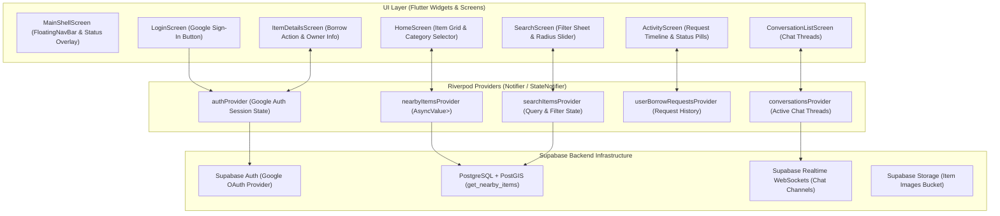
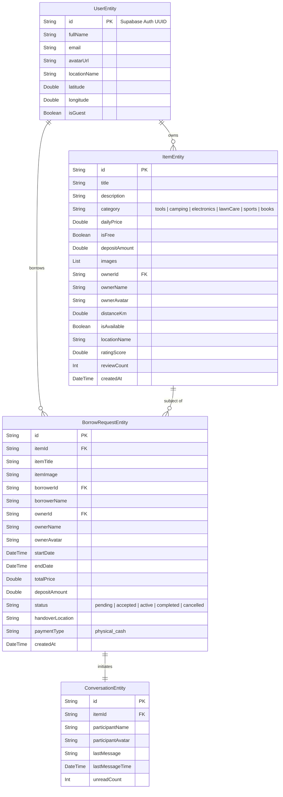

# Architecture Documentation: Borrowly

## 1. System Overview

**Borrowly** is a hyper-local peer-to-peer item sharing and borrowing community platform built with Flutter and Supabase. The application enables neighbors to list, discover, borrow, and lend household items, camping gear, tools, and electronics within their local community.

The platform is designed around **Supabase Backend Services** (PostGIS spatial queries, Google Auth, Real-Time WebSockets), **Physical In-Person Cash Handovers**, **Riverpod unidirectional data flow**, **GoRouter shell branch navigation**, and a **glassmorphic design system**.

---

## 2. Tech Stack & Core Libraries

| Layer / Aspect | Framework / Tool | Purpose & Usage |
| :--- | :--- | :--- |
| **Framework & Language** | Flutter 3.x & Dart 3.x | Cross-platform UI engine targeting Android and iOS |
| **State Management & DI** | Flutter Riverpod | Reactive state management, dependency injection, and data providers |
| **Navigation & Routing** | GoRouter 13.x | Declarative routing with `StatefulShellRoute.indexedStack` for stateful tab preservation |
| **Backend & Database** | Supabase Flutter (`2.3.0`) | PostgreSQL database with PostGIS, Real-Time WebSockets, and CDN Storage |
| **Authentication** | Google Sign-In (`google_sign_in`) | Single-click Google Sign-In authenticated via Supabase OAuth / ID Token |
| **Payment Model** | Physical / Cash Handover | Zero in-app gateway fees; payments and deposits settled physically during item pickup/return |
| **Local Cache** | Hive & Hive Flutter | Fast key-value local caching for offline user preferences |
| **Async Performance** | Dart Isolates (`compute()`) | Background thread execution for heavy item filtering, distance sorting, and search matching |
| **Typography & Aesthetics** | Google Fonts (Outfit) | Modern typography with curated color tokens (`AppColors`) and glassmorphism |

---

## 3. High-Level Architecture (MVVM & UDF)

Borrowly strictly follows **Model-View-ViewModel (MVVM)** combined with **Unidirectional Data Flow (UDF)** powered by Riverpod.



---

## 4. Domain Data Models & Entities



---

## 5. Directory Structure

```
lib/
├── app/                         # Global Application Setup & Configuration
│   ├── app.dart                 # Root MaterialApp widget & Riverpod router listener
│   ├── router/                  # GoRouter configuration & StatefulShellRoute definition
│   └── theme/                   # Aesthetic Design System (Colors, Typography, Spacing)
├── core/                        # Core Shared Infrastructure
│   ├── network/                 # Supabase client & network wrappers
│   ├── storage/                 # Hive local storage service & theme providers
│   └── widgets/                 # Reusable UI Components (Cards, Buttons, Toasts, Badges)
└── features/                    # Feature-Sliced Modules
    ├── auth/                    # Google Sign-In, Auth State Notifiers, & Login Screen
    ├── activity/                # Request History, Status Timeline, & Activity Screen
    ├── chat/                    # Real-time Conversation List & Chat Screens
    ├── home/                    # Home Dashboard, Category Selectors, & Item Feed
    ├── item/                    # Item Details, Add Item Screen, & Item Cards
    ├── main_shell/              # Shell Screen, Floating Nav Bar, & Back Dispatcher
    ├── notification/            # Notification Center & Unread Badges
    ├── profile/                 # Profile Settings & Logout Confirmation Modal
    ├── search/                  # Search Filter Screen, Radius Slider, & Grid
    └── splash/                  # Instant Non-Blocking Splash Animation
```
