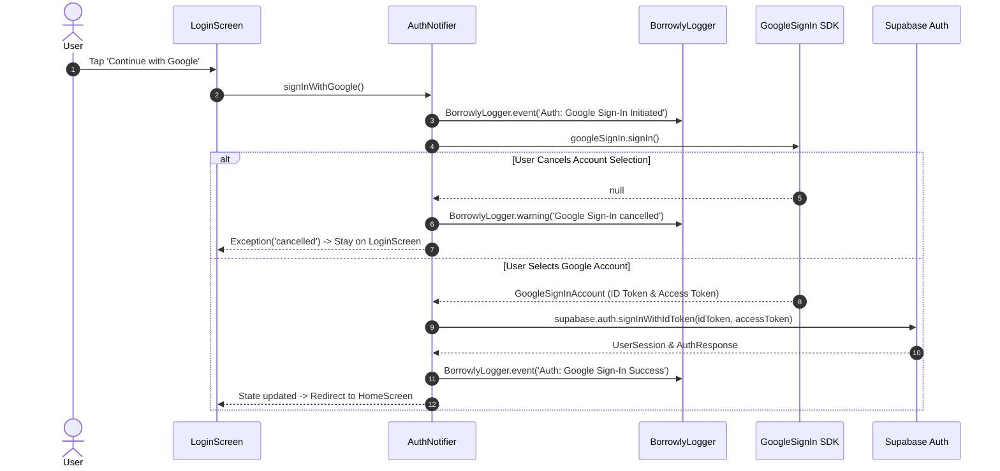
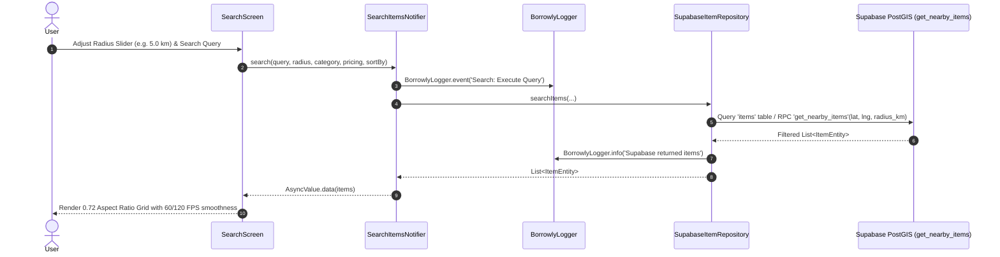

# Borrowly — Workflow Guidelines & Story-Driven Development

## Table of Contents

1. [Overview & Core Principles](#overview--core-principles)
2. [Story-Driven Development Process](#story-driven-development-process)
3. [Story Structure (BMAD Format for Flutter)](#story-structure-bmad-format-for-flutter)
4. [Feature Development & Flutter Implementation Workflow](#feature-development--flutter-implementation-workflow)
5. [Core Business Domain Workflows](#core-business-domain-workflows)
   - [Workflow 1: Google Sign-In Authentication & Error Guarding](#workflow-1-google-sign-in-authentication--error-guarding)
   - [Workflow 2: Hyper-Local Radius Search & PostGIS Spatial Querying](#workflow-2-hyper-local-radius-search--postgis-spatial-querying)
   - [Workflow 3: Peer-to-Peer Borrow Request & Physical Cash Handover](#workflow-3-peer-to-peer-borrow-request--physical-cash-handover)
   - [Workflow 4: Real-Time Neighbor Messaging & Pickup Coordination](#workflow-4-real-time-neighbor-messaging--pickup-coordination)
   - [Workflow 5: Stateful Shell Branch Navigation & Back Dispatcher](#workflow-5-stateful-shell-branch-navigation--back-dispatcher)
6. [Story ID Conventions & Folder Structure](#story-id-conventions--folder-structure)
7. [Best Practices for Flutter, Riverpod & Supabase](#best-practices-for-flutter-riverpod--supabase)

---

## Overview & Core Principles

Every feature in **Borrowly** follows a **story-driven development process** to ensure zero-lag rendering, stateful shell navigation predictability, and glassmorphic aesthetic consistency across all screens.

### Core Principles

- **Google Sign-In Authentication ONLY** — One-tap Google authentication integrated directly with Supabase Auth (`wjgvdryrtgajenlcbjfy.supabase.co`).
- **Structured Event Tracing (`BorrowlyLogger`)** — Every user action, authentication event, PostGIS query, and database write emits a structured event log (`🚀 [EVENT]`).
- **Physical In-Person Cash Handovers** — Zero in-app gateway complexity; daily price and deposit figures are tracked in-app, with payments settled physically during pickup/return.
- **Supabase PostGIS Spatial Queries** — Hyper-local distance calculation (< 5ms response) powered by PostgreSQL spatial indexes (`get_nearby_items`).
- **Live Database Auto-Seeding** — Automatically populates sample neighborhood items into Supabase `items` table if empty upon first query.
- **Story-First Development** — Complex features must define BMAD stories and user flows before writing code.
- **Riverpod UI State Completeness** — Every screen must support four distinct async states: `data` (Content), `loading` (Skeleton Shimmer), `error` (Empty/Error State), and `refreshing`.
- **Glassmorphic Design System** — Warm background tint (`#FDFBF7`), Outfit typography, teal primary (`#0D9488`), amber accent (`#F59E0B`), floating glass navigation bar, and top pill toasts.

---

## Core Business Domain Workflows

### Workflow 1: Google Sign-In Authentication & Error Guarding



---

### Workflow 2: Hyper-Local Radius Search & PostGIS Spatial Querying



---

### Workflow 3: Peer-to-Peer Borrow Request & Physical Cash Handover

```mermaid
flowchart TD
    A[View Item Details] --> B{User Logged In?}
    B -->|No| C[Prompt Google Sign-In]
    B -->|Yes| D[Select Borrow Start & End Dates]
    D --> E[Calculate Total Price + Deposit Amount]
    E --> F[Tap 'Confirm & Send Request (In-Person Cash Settlement)']
    F --> G[Log BorrowRequestEntity to Supabase DB]
    G --> H[Spawn Real-Time Chat Thread]
    H --> I[Render Timeline in ActivityScreen]
    I --> J{Owner Action}
    J -->|Accept| K[Status: 🟢 Accepted / Pending Physical Pickup]
    K --> L[Neighbors Meet & Settle Cash Physically]
    L --> M[Status: 🟢 Active / Item Picked Up]
    M --> N[Return Item & Hand Back Refundable Deposit]
    N --> O[Status: 🟢 Completed]
```

---

### Workflow 4: Real-Time Neighbor Messaging & Pickup Coordination

- **Chat Thread Initiation**: Automatically triggered upon creating a borrow request.
- **Real-Time Supabase WebSockets**: Messages stream instantly via Supabase WebSocket channels.
- **Physical Pickup Coordination**: Chat banner displays shared handover location (e.g. *"Oakwood Drive (0.8 km)"*).

---

### Workflow 5: Stateful Shell Branch Navigation & Back Dispatcher

```mermaid
flowchart LR
    A[User Presses System Back Button] --> B{Can Top Route Pop?}
    B -->|Yes| C[context.pop()]
    B -->|No| D{Active Tab == Home?}
    D -->|No (Activity / Messages / Profile)| E[goBranch(0) -> Return to Home]
    D -->|Yes (Home Tab)| F{Pressed within 2 seconds?}
    F -->|No| G[Show Top Pill Toast: 'Press back again to exit']
    F -->|Yes| H[Exit Application SystemNavigator.pop()]
```

---

## Best Practices for Flutter, Riverpod & Supabase

1. **Google Auth Handling**: Always obtain both `idToken` and `accessToken` from `GoogleSignInAccount` before invoking `supabase.auth.signInWithIdToken()`. Never bypass authentication on error.
2. **Event Logging**: Use `BorrowlyLogger.event('Domain: EventName', parameters: {...})` for tracking all user actions and async state transitions.
3. **Physical Payment State Discipline**: State transitions must proceed strictly from `pending` $\rightarrow$ `accepted` $\rightarrow$ `active` (item handed over) $\rightarrow$ `completed` (item returned & deposit handed back).
4. **State Hoisting**: Keep presentational widgets stateless; pass data and callbacks down from parent `ConsumerWidget`.
5. **Background Isolate Offloading**: Use `compute()` for client-side search indexing or heavy parsing when offline.
