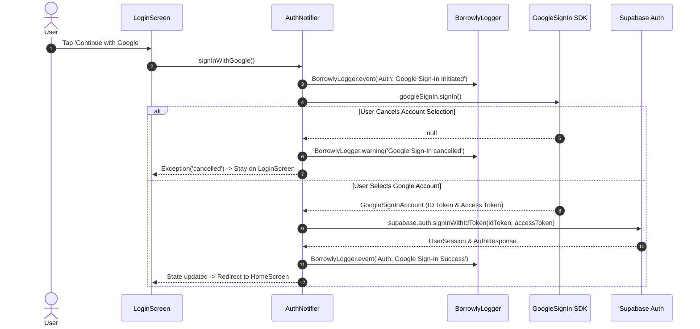
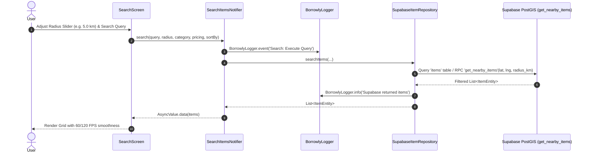
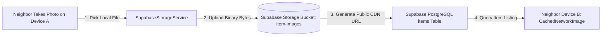
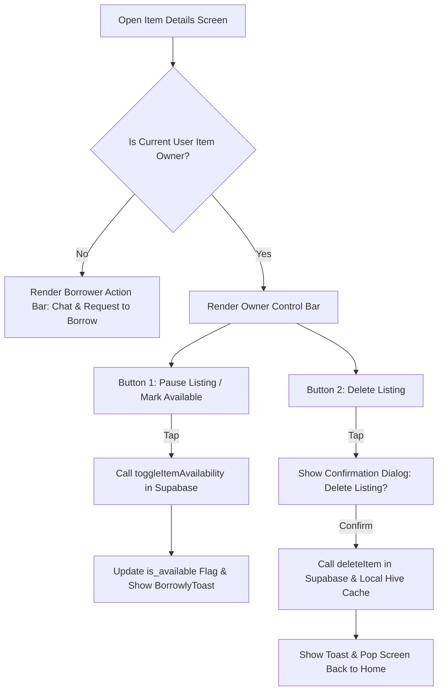

# Borrowly — Workflow Guidelines & Story-Driven Development

## Table of Contents

1. [Overview & Core Principles](#overview--core-principles)
2. [Story-Driven Development Process](#story-driven-development-process)
3. [Core Business Domain Workflows](#core-business-domain-workflows)
   - [Workflow 1: Google Sign-In Authentication & Error Guarding](#workflow-1-google-sign-in-authentication--error-guarding)
   - [Workflow 2: Hyper-Local Radius Search & PostGIS Spatial Querying](#workflow-2-hyper-local-radius-search--postgis-spatial-querying)
   - [Workflow 3: Supabase Cloud Storage Photo Upload & Global CDN Delivery](#workflow-3-supabase-cloud-storage-photo-upload--global-cdn-delivery)
   - [Workflow 4: Item Lifecycle & Owner Controls (Pause & Delete)](#workflow-4-item-lifecycle--owner-controls-pause--delete)
   - [Workflow 5: Peer-to-Peer Borrow Request & Physical Cash Handover](#workflow-5-peer-to-peer-borrow-request--physical-cash-handover)
   - [Workflow 6: Real-Time Neighbor Messaging & Pickup Coordination](#workflow-6-real-time-neighbor-messaging--pickup-coordination)
   - [Workflow 7: Stateful Shell Branch Navigation & Back Dispatcher](#workflow-7-stateful-shell-branch-navigation--back-dispatcher)
4. [Best Practices for Flutter, Riverpod & Supabase](#best-practices-for-flutter-riverpod--supabase)

---

## Overview & Core Principles

Every feature in **Borrowly** follows a **story-driven development process** to ensure zero-lag rendering, stateful shell navigation predictability, and glassmorphic aesthetic consistency across all screens.

### Core Principles

- **Google Sign-In Authentication ONLY** — One-tap Google authentication integrated directly with Supabase Auth (`wjgvdryrtgajenlcbjfy.supabase.co`).
- **Structured Event Tracing (`BorrowlyLogger`)** — Every user action, authentication event, PostGIS query, and database write emits a structured event log (`🚀 [EVENT]`).
- **Supabase Cloud Storage Uploads** — Local item photos automatically upload to public Supabase Storage bucket (`item-images`), generating HTTPS CDN URLs for global cross-device rendering.
- **Item Owner Control & Lifecycle** — Item owners can toggle availability (`Pause Listing` vs `Mark Available`) or permanently `Delete Listing` via confirmation modal.
- **Physical In-Person Cash Handovers** — Zero in-app gateway complexity; daily price and deposit figures are tracked in-app, with payments settled physically during pickup/return.
- **Supabase PostGIS Spatial Queries** — Hyper-local distance calculation (< 5ms response) powered by PostgreSQL spatial indexes (`get_nearby_items`).
- **Unified Native Launch & Splash Screen** — Locked `#F5F2EB` launch window background and single animated Flutter `SplashScreen` widget.
- **Locked Light Mode Aesthetics** — Warm eggshell background (`#F5F2EB`), Outfit typography, Scandinavian Sage (`#2E5A44`), amber accent (`#F59E0B`), floating glass navigation bar, and top pill toasts.

---

## Core Business Domain Workflows

### Workflow 1: Google Sign-In Authentication & Error Guarding



---

### Workflow 2: Hyper-Local Radius Search & PostGIS Spatial Querying



---

### Workflow 3: Supabase Cloud Storage Photo Upload & Global CDN Delivery



---

### Workflow 4: Item Lifecycle & Owner Controls (Pause & Delete)



---

### Workflow 5: Peer-to-Peer Borrow Request & Physical Cash Handover

```mermaid
flowchart TD
    A[View Item Details] --> B{User Logged In?}
    B -->|No| C[Prompt Google Sign-In]
    B -->|Yes| D[Select Borrow Start & End Dates]
    D --> E[Calculate Total Price + Deposit Amount]
    E --> F[Tap 'Confirm & Send Request (In-Person Cash Settlement)']
    F --> G[Log BorrowRequestEntity to Supabase DB]
    G --> H[Spawn Real-Time Chat Thread]
    H --> I[Render Timeline in ActivityScreen]
    I --> J{Owner Action}
    J -->|Accept| K[Status: 🟢 Accepted / Pending Physical Pickup]
    K --> L[Neighbors Meet & Settle Cash Physically]
    L --> M[Status: 🟢 Active / Item Picked Up]
    M --> N[Return Item & Hand Back Refundable Deposit]
    N --> O[Status: 🟢 Completed]
```

---

### Workflow 6: Real-Time Neighbor Messaging & Pickup Coordination

- **Chat Thread Initiation**: Automatically triggered upon creating a borrow request.
- **Real-Time Supabase WebSockets**: Messages stream instantly via Supabase WebSocket channels.
- **Physical Pickup Coordination**: Chat banner displays shared handover location (e.g. *"Oakwood Drive (0.8 km)"*).

---

### Workflow 7: Stateful Shell Branch Navigation & Back Dispatcher

```mermaid
flowchart LR
    A[User Presses System Back Button] --> B{Can Top Route Pop?}
    B -->|Yes| C[context.pop()]
    B -->|No| D{Active Tab == Home?}
    D -->|No (Activity / Messages / Profile)| E[goBranch(0) -> Return to Home]
    D -->|Yes (Home Tab)| F{Pressed within 2 seconds?}
    F -->|No| G[Show Top Pill Toast: 'Press back again to exit']
    F -->|Yes| H[Exit Application SystemNavigator.pop()]
```

---

## Best Practices for Flutter, Riverpod & Supabase

1. **Cloud Image Delivery**: Always route local file paths through `SupabaseStorageService.uploadItemImages(...)` before saving listings to Supabase PostgreSQL.
2. **Item Owner Actions**: Ensure item detail screens differentiate between owner controls (`Pause` & `Delete`) and borrower actions (`Chat` & `Request to Borrow`).
3. **Google Auth Handling**: Always obtain both `idToken` and `accessToken` from `GoogleSignInAccount` before invoking `supabase.auth.signInWithIdToken()`. Never bypass authentication on error.
4. **Event Logging**: Use `BorrowlyLogger.event('Domain: EventName', parameters: {...})` for tracking all user actions and async state transitions.
5. **Physical Payment State Discipline**: State transitions must proceed strictly from `pending` $\rightarrow$ `accepted` $\rightarrow$ `active` (item handed over) $\rightarrow$ `completed` (item returned & deposit handed back).
6. **State Hoisting**: Keep presentational widgets stateless; pass data and callbacks down from parent `ConsumerWidget`.
7. **Background Isolate Offloading**: Use `compute()` for client-side search indexing or heavy parsing when offline.
